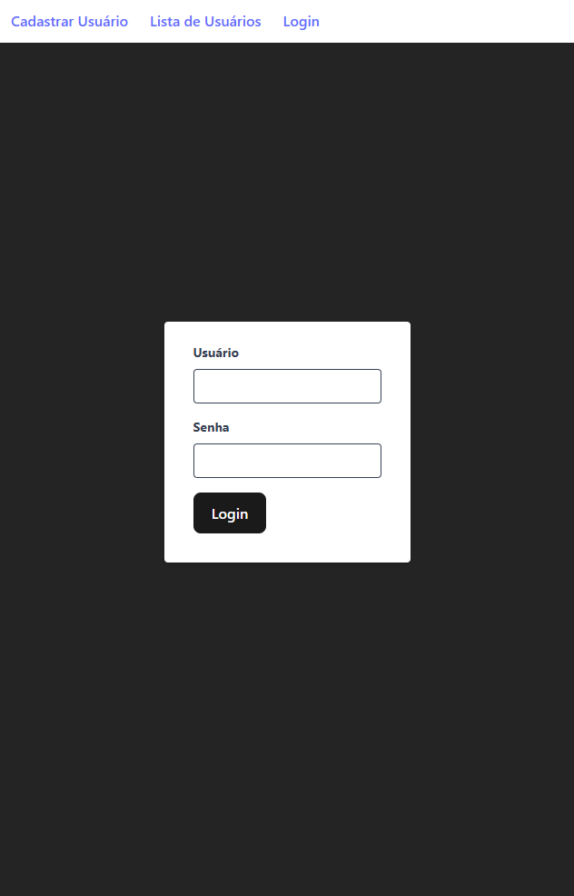
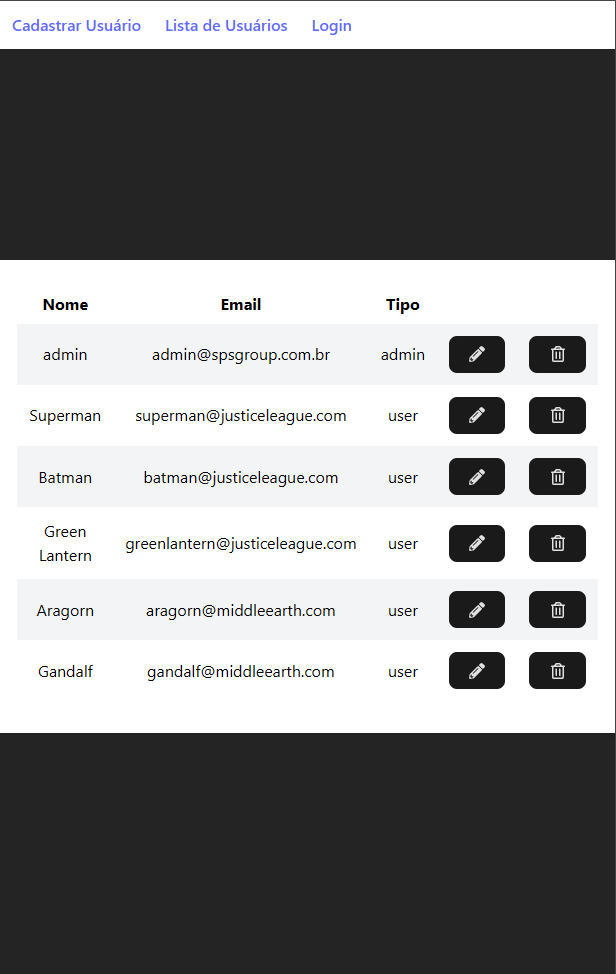

# Cadastro Usuários - Frontend

[Tecnologias](#tecnologias) | [Funcionalidades](#funcionalidades) | [Descrição](#descrição) | [Instalação](#instalação) | [Avisos](#avisos) | [Imagens](#imagens) | [Suporte](#suporte) | [Todo](#todo) 

## Tecnologias

<ul>
  <li>React</li>
  <li>UseContext</li>
  <li>React Router</li>
</ul>

[Ir para o topo](#cadastro-usuários---frontend)

## Funcionalidades

<ul>
  <li>Cadastro de usuário</li>
  <li>Visualização de usuários cadastrados</li>
  <li>Edição de usuário cadastrados</li>
  <li>Remoção de usuário cadastrados</li>
  <li>Mensagens de status para requisições de POST, PATCH e DELETE</li>
  <li>Redirecionamento para tela de login em caso de token expirado ou não armazenado no local storage</li>
</ul>

[Ir para o topo](#cadastro-usuários---frontend)

## Descrição

Frontend do projeto Cadastro de Usuários. Descrição do desafio:

SPS REACT TEST

Criar um CRUD de usuários

Regras
- Criar a página de signIn para fazer a autenticação do usuário (Usar o usuário previamente cadastrado para validar)
- Pode usar qualquer tipo de storage para guardar o token
- Só será possível cadastrar e/ou visualizar os usuários se estiver autenticado
- Chamar a API que foi criada anteriormente (test-sps-server) 

[Ir para o topo](#cadastro-usuários---frontend)

## Instalação

1. Crie uma pasta para o projeto e entre nela
```bash
mkdir cadastro-usuarios 
cd cadastro-usuarios
```

2. Clone o repositório do frontend e entre na pasta criada
```bash
git clone git@github.com:rushxpush/cadastro-usuarios-frontend.git
cd cadastro-usuarios-frontend
```

3. Abra uma outra aba do terminal sem fechar a primeira, entre na pasta cadastro-usuarios, clone o repositório do backend e entre na pasta criada
```bash
git clone git@github.com:rushxpush/cadastro-usuarios-backend.git
cd cadastro-usuarios-backend
```

4. Em ambas abas do terminal abertas, rode o comando abaixo para montar a imagem e rodar o app:
```bash
docker compose up --build
```

5. Acesse a página em [localhost:8000](http://localhost:8000) (Usuário: admin | Senha: 1234)

6. Porta do backend em [localhost:3000](http://localhost:3000)

[Ir para o topo](#cadastro-usuários---frontend)

## Avisos

Futuros avisos

[Ir para o topo](#cadastro-usuários---frontend)

## Imagens





[Ir para o topo](#cadastro-usuários---frontend)

## Suporte

Qualquer dúvida mande um email para [rafagarciadev@gmail.com](mailto:rafagarciadev@gmail.com)

[Ir para o topo](#cadastro-usuários---frontend)

## Todo 

- &#x2610; Testes unitários
- &#x2610; Testes e2e 
- &#x2610; Estilizar para mobile

[Ir para o topo](#cadastro-usuários---frontend)